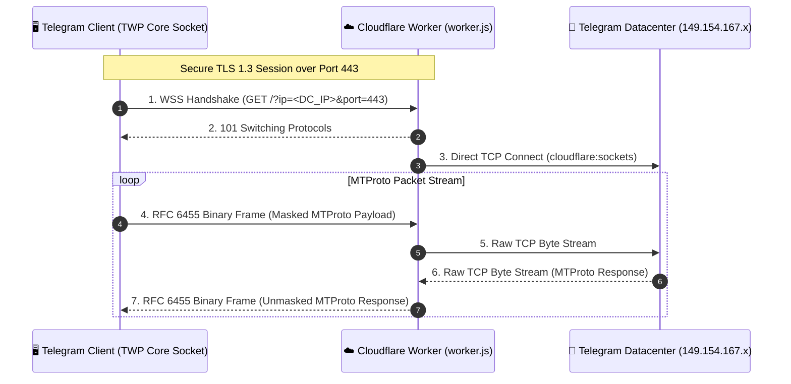

<div align="center">

# ⚡ TWP (Telegram Worker Proxy) Core

**High-Performance MTProto-over-WebSocket Transport Engine & Protocol Specification**  
*هسته پروتکل و موتور تونلینگ کلاینت-سرور تلگرام بر پایه ورکر کلادفلر*

[](LICENSE)
[-orange.svg)](https://workers.cloudflare.com)
[-purple.svg)](docs/PROTOCOL.md)
[](docs/PROTOCOL.md)
[](https://t.me/Qorvhex_Channel)

[معرفی هسته (FA)](#-معرفی-هسته-twp-core) • [English Documentation](#-english-documentation) • [Architecture](#-معماری-پروتکل-architecture) • [Server Engine](#-موتور-سرور-server-engine-workerjs) • [Client Integration](#-یکپارچه‌سازی-کلاینت-client-integration) • [Protocol Spec](#-مشخصات-پروتکل-و-پارامترهای-اتصال-protocol-spec) • [کانال تلگرام](#-ارتباط-و-جامعه-کاربری-community--updates)

</div>

---

## 📖 معرفی هسته (TWP Core)

پروژه **TWP (Telegram Worker Proxy)** یک هسته سبک، ماژولار و متن‌باز برای انتقال ترافیک پروتکل MTProto تلگرام از طریق شبکه توزیع‌شده Cloudflare Workers است. 

این مخزن به عنوان **هسته مرجع (Reference Core Implementation)** و **مستندات پروتکل** عمل می‌کند و به توسعه‌دهندگان، سازندگان کلاینت‌های تلگرام و مدیران شبکه این امکان را می‌دهد تا بدون نیاز به سرورهای سنتی VPS، ارتباطی امن، ضد فیلتر و پرسرعت را میان کلاینت‌های تلگرام و دیتاسنترهای رسمی برقرار کنند.

---

## 🌟 اجزای تشکیل‌دهنده هسته (Core Components)

| بخش | مسیر در مخزن | شرح وظیفه |
| :--- | :--- | :--- |
| **Server Core Engine** | [`worker.js`](worker.js) | موتور سرورلس کلادفلر با استفاده از `cloudflare:sockets` برای تبدیل فریم‌های WSS به اتصال TCP دیتاسنترهای تلگرام |
| **Client Core Engine** | [`client/src/`](client/src/) | پیاده‌سازی مرجع سوکت کلاینت (C++20) مشتق از `AbstractSocket` برای تزریق به کلاینت‌های تلگرام |
| **Protocol Specification** | [`docs/PROTOCOL.md`](docs/PROTOCOL.md) | مشخصات اتصال هسته، پارامترهای ورکر، فریم‌بندی RFC 6455 و احراز هویت |
| **Architecture Docs** | [`docs/ARCHITECTURE.md`](docs/ARCHITECTURE.md) | مدل فنی، جریان داده‌ها و مقایسه امنیتی و عملکردی با MTProxy و SOCKS5 |

---

## 🏗️ معماری پروتکل (Architecture)


---

## ☁️ موتور سرور (Server Engine: `worker.js`)

موتور سرور یک اسکریپت مستقل جاوااسکریپت برای محیط رانتایم Cloudflare Workers است. این موتور:
1. ارتباط وب‌سوکت دوطرفه امن (Full-Duplex WSS) را با کلاینت برقرار می‌کند.
2. با استفاده از ماژول استاندارد `cloudflare:sockets`، یک سوکت خام TCP به IP و پورت دیتاسنتر مورد نظر تلگرام باز می‌کند.
3. با استفاده از بافرهای `ArrayBuffer` و مدیریت هوشمند جریان داده، پکت‌ها را با کمترین تأخیر ممکن (Zero-Copy Streaming) بین دو سوکت رد و بدل می‌کند.
4. در صورت اتصال مرورگر به آدرس ورکر، یک صفحه وب سبک برای تست وضعیت و مشخصات سرور نمایش می‌دهد.

### استقرار هسته سرور:

```bash
# ۱. کلون کردن ریپازیتوری
git clone https://github.com/your-username/TWP.git
cd TWP

# ۲. ورود به اکانت کلادفلر
npx wrangler login

# ۳. استقرار فوری
npx wrangler deploy
```

یا کپی کردن مستقیم محتوای [`worker.js`](worker.js) در ویرایشگر داشبورد Cloudflare.

---

## 💻 یکپارچه‌سازی کلاینت (Client Integration)

توسعه‌دهندگان کلاینت‌های تلگرام (شامل Telegram Desktop، تلگرام‌های غیررسمی اندروید، ربات‌ها و ابزارهای واسط) می‌توانند از کدهای آماده پوشه [`client/src/`](client/src/) استفاده کنند:

- [`mtproto_worker_socket.h`](client/src/mtproto_worker_socket.h): تعریف کلاس سوکت کلاینت با متدهای استاندارد `AbstractSocket`.
- [`mtproto_worker_socket.cpp`](client/src/mtproto_worker_socket.cpp): پیاده‌سازی کامل استتار فریم‌ها، ماسک تصادفی ۴ بایتی، و تبدیل دیتای خام به WSS.
- [`integration_guide.md`](client/src/integration_guide.md): راهنمای گام‌به‌گام تزریق کد به پروژه‌های مبتنی بر Qt / C++.

---

## 📜 مشخصات پروتکل و پارامترهای اتصال (Protocol Spec)

پروتکل TWP ساختار صوری یا شمای لینک ثابتی به کلاینت‌ها تحمیل نمی‌کند؛ معیار اصلی، انطباق پارامترهای تنظیمی کلاینت با لایه ورودی موتور [`worker.js`](worker.js) و هندشیک استاندارد WebSocket است. کلاینت‌ها و برنامه‌های واسط مختارند پارامترهای اتصال را از طریق هر فرمت آدرس‌دهی استاندارد (مانند الگوهای مرسوم RFC 3986 یا لینک‌های سفارشی کلاینت) دریافت و پردازش نمایند.

### پارامترهای ورودی مورد نیاز هسته ورکر:

| پارامتر | جایگاه مجاز در درخواست | پیش‌فرض | توضیحات فنی |
| :--- | :--- | :--- | :--- |
| **دامنه سرور ورکر** | Host / SNI | — | آدرس ورکر کلادفلر جهت برقراری نشست امن TLS روی پورت ۴۴۳. |
| **`ip`** | Query Param یا URL Path | `149.154.167.50` | آدرس IPv4 دیتاسنتر مقصد تلگرام جهت اتصال مستقیم با سوکت TCP (`cloudflare:sockets`). |
| **`port`** | Query Param یا URL Path | `443` | پورت TCP دیتاسنتر تلگرام (پورت‌های استاندارد: ۴۴۳ یا ۸۰). |
| **`secret`** | Query / Path / هدر `X-Worker-Secret` | اختیاری | توکن اعتبارسنجی اتصال (در صورت تعریف متغیر محیطی `SECRET` در ورکر). |

برای جزئیات دقیق هندشیک ارتقای پروتکل (RFC 6455 Upgrade) و ساختار فریم‌بندی باینری به [docs/PROTOCOL.md](docs/PROTOCOL.md) مراجعه فرمایید.


---

## 🌐 English Documentation

### Overview
**TWP (Telegram Worker Proxy)** is an open-source, modular, high-performance reference core designed to tunnel Telegram MTProto network traffic through the Cloudflare Workers globally distributed serverless edge via secure WebSockets (WSS).

This repository serves as both the **Reference Core Implementation** and the **Official Protocol Specification**, enabling developers, custom Telegram client maintainers, and network engineers to establish secure, censorship-resistant, low-latency connections to official Telegram Datacenters without requiring traditional VPS servers.

### Key Highlights
- **Zero VPS Cost:** Runs entirely on Cloudflare Workers serverless edge (free tier compatible).
- **DPI-Immune Transport:** Pure HTTPS / WSS traffic over standard Port 443 with TLS 1.3 encryption (RFC 6455 binary framing).
- **Global Anycast Routing:** Automatically routes through the nearest Cloudflare edge PoP (200+ cities globally).
- **Zero-Copy Streaming:** High-efficiency binary bridging between `cloudflare:sockets` TCP streams and WebSocket frames.

---

### Core Architecture



---

### Repository Structure

| Component | File / Path | Purpose |
| :--- | :--- | :--- |
| **Server Engine** | [`worker.js`](worker.js) | Serverless edge script bridging WSS frames to Telegram DC TCP sockets using `cloudflare:sockets`. |
| **Client Socket Core** | [`client/src/`](client/src/) | Reference C++20 client socket implementing `AbstractSocket` for direct embedding into Telegram clients. |
| **Protocol Specification** | [`docs/PROTOCOL.md`](docs/PROTOCOL.md) | Technical protocol spec, parameter definitions, RFC 6455 framing, and handshake rules. |
| **Architecture Specification** | [`docs/ARCHITECTURE.md`](docs/ARCHITECTURE.md) | Architectural model, security analysis, and comparisons with standard MTProxy and SOCKS5. |

---

### Server Deployment (`worker.js`)

#### Deploy via Wrangler CLI:
```bash
# 1. Clone repository
git clone https://github.com/Qorvhex/TWP.git
cd TWP

# 2. Authenticate with Cloudflare
npx wrangler login

# 3. Deploy worker
npx wrangler deploy
```

#### Deploy via Cloudflare Dashboard:
1. Log in to [Cloudflare Dashboard](https://dash.cloudflare.com/).
2. Navigate to **Workers & Pages** > **Create application** > **Create Worker**.
3. Replace the default template with [`worker.js`](worker.js) and click **Save and deploy**.
4. *(Optional)* Add a secret under **Settings** > **Variables and Secrets** named `SECRET` for access control.

---

### Client Integration

Developers of custom Telegram clients (Telegram Desktop, Android forks, and bridge apps such as [Bifrost](https://github.com/Qorvhex/Bifrost)) can integrate the reference C++ implementation from [`client/src/`](client/src/):
- [`mtproto_worker_socket.h`](client/src/mtproto_worker_socket.h): Socket header matching Telegram's `AbstractSocket` interface.
- [`mtproto_worker_socket.cpp`](client/src/mtproto_worker_socket.cpp): RFC 6455 frame obfuscation, 4-byte cryptographic masking, and raw-to-WSS conversion.
- [`integration_guide.md`](client/src/integration_guide.md): Step-by-step injection guide for Qt/C++ Telegram codebases.

---

### Protocol Specification & Parameters

The TWP core does not enforce a rigid URI scheme; clients are free to use any standard URI convention (e.g., RFC 3986 or custom deep links) as long as the parameters match the inputs expected by [`worker.js`](worker.js):

| Parameter | Accepted Location | Default | Description |
| :--- | :--- | :--- | :--- |
| **Worker Host** | Host / SNI | — | FQDN domain of the Cloudflare Worker (TLS over Port 443). |
| **`ip`** | Query Param or URL Path | `149.154.167.50` | Destination Telegram Datacenter IPv4 address. |
| **`port`** | Query Param or URL Path | `443` | Destination Telegram Datacenter TCP port (`443` or `80`). |
| **`secret`** | Query / Path / `X-Worker-Secret` Header | Optional | Authentication token matching the Worker's `SECRET` variable. |


---

## 📢 ارتباط و جامعه کاربری (Community & Updates)

جهت دریافت آخرین اخبار، به‌روزرسانی‌های هسته TWP، آموزش‌ها و آی‌پی‌های تمیز کلادفلر به کانال رسمی تلگرام بپیوندید:

<div align="center">

[](https://t.me/Qorvhex_Channel)

👉 **[کانال رسمی تلگرام: @Qorvhex_Channel](https://t.me/Qorvhex_Channel)** 👈

</div>

---

## 📄 مجوز (License)

این هسته تحت مجوز **MIT License** منتشر شده است و هرگونه استفاده، توسعه یا ادغام آن در کلاینت‌های تجاری و متن‌باز بلامانع است.
